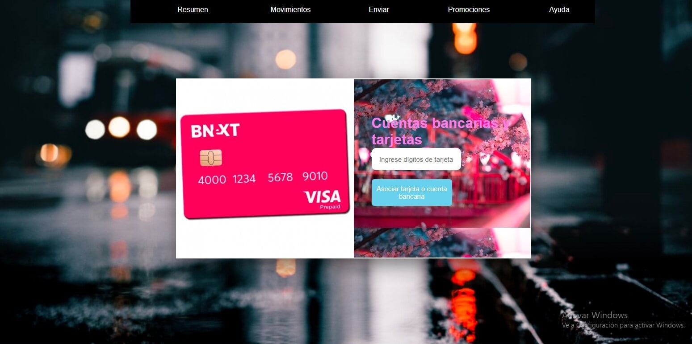
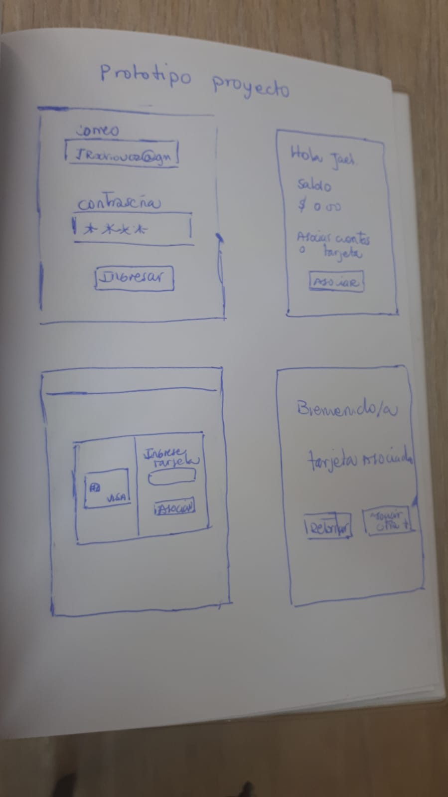

# Tarjeta de crédito válida

* Un título con el nombre de tu proyecto.
  Asociar tarjeta de crédito

* Un resumen de 1 o 2 líneas de qué se trata tu proyecto.

  Página que permite asociar tu tarjeta a una plataforma estilo Paypal desde donde podrás realizar compras y pagos de forma directa Y segura sin la necesidad de anexar una y otra vez la tarjeta para diversas operaciones.

* La imagen final de tu proyecto.
  

* Investigación UX:
  1. Explicar quiénes son los usuarios y los objetivos en relación con el
    producto.
  Al implementarse las plataformas de compra virtual son cada vez más las personas entre 16 y 50 años que buscan adquirir productos en el extranjero debido a los competitivos precios del mercado,el proceso de pago para completar la compra puede volverse tedioso debido a que algunas plataformas solo aceptan como medio de pago Paypal o se debe ingresar la tarjeta cada vez que se quiera adquirir un producto o servicio a fin de optimizar los tiempos, mejorar la interacción y experiencia del usuario al asociar una o varias tarjetas de uso frecuente es una opción que le de al cliente la comodidad de realizar un pago en un solo click.

  2. Explicar cómo el producto soluciona los problemas/necesidades de dichos
    usuarios.
  A fin de optimizar el proceso de pago se le da la opción al usuario de asociar su tarjeta de uso frecuente en una plataformas de pago de modo que al registrar su tarjeta por única vez esta quedará vinculada a su cuenta y podrá realizar cualquier pago autorizando la compra desde un boton en la pantalla de su computadora lo que permitirá una experiencia más ágil de uso.

  3. Luego colocarás la foto de tu primer prototipo en papel.
  

  4. Agregar un resumen del feedback recibido indicando las mejoras a realizar.
  En mi función para validar contiene 2 alertas que debo suprimir y utilizar un addEventlistener para llamar  a la segunda pantalla. 

  5. Imagen del prototipo final.

