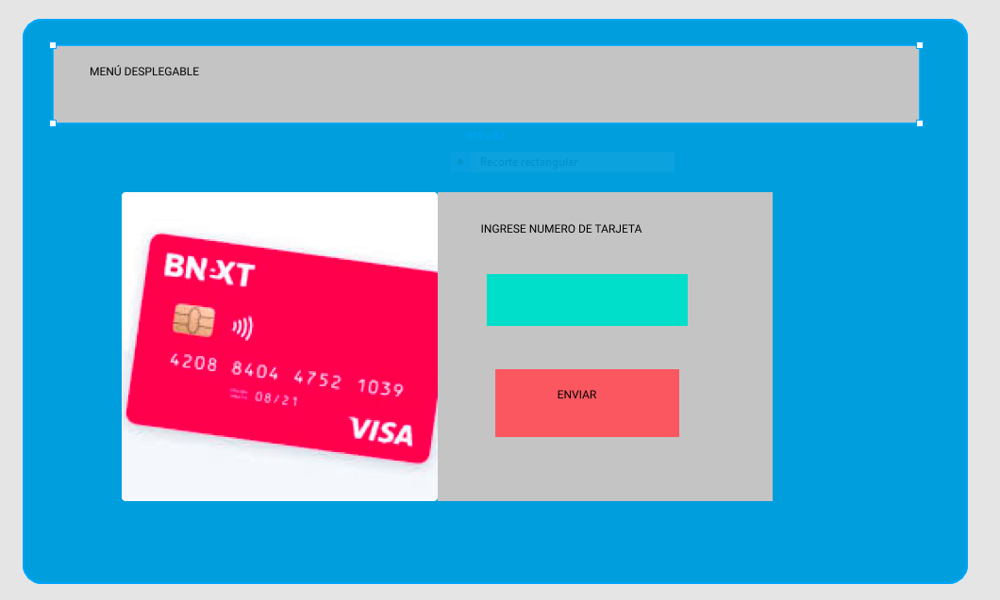

# TARJETA DE CRÉDITO-BANEXPAY

* 1.RESUMEN DEL PROYECTO

  Página que permite asociar tu tarjeta a una plataforma estilo Paypal desde donde podrás realizar compras y pagos de forma directa Y segura sin la necesidad de anexar una y otra vez la tarjeta para diversas operaciones.

* 2.IMAGEN FINAL DEL PROYECTO
  

* 3.INVESTIGACIÓN UX

  * 3.1. Explicar quiénes son los usuarios y los objetivos en relación con el
    producto.
  Al implementarse las plataformas de compra virtual son cada vez más las personas entre 16 y 50 años que buscan adquirir productos en el extranjero debido a los competitivos precios del mercado,el proceso de pago para completar la compra puede volverse tedioso debido a que algunas plataformas solo aceptan como medio de pago Paypal o se debe ingresar la tarjeta cada vez que se quiera adquirir un producto o servicio a fin de optimizar los tiempos, mejorar la interacción y experiencia del usuario al asociar una o varias tarjetas de uso frecuente es una opción que le da al cliente la comodidad de realizar un pago en un solo click.

  * 3.2 Explicar cómo el producto soluciona los problemas/necesidades de dichos
    usuarios.
  A fin de optimizar el proceso de pago se le da la opción al usuario de asociar su tarjeta de uso frecuente en una plataformas de pago de modo que al registrar su tarjeta por única vez esta quedará vinculada a su cuenta y podrá realizar cualquier pago autorizando la compra desde un boton en la pantalla de su computadora lo que permitirá una experiencia más ágil de uso.

  * 3.3 PROTOTIPO EN PAPEL.
  

4. FEEDBACK.

   4.1 Organizar mejor los tiempos. 
   4.2 Desarrollar la funcionalidad de la página de la mano con el diseño.
   4.3 Pedir feedback cuando lo necesite.

5. PROTOTIPO FINAL.
  

6. Objetivos de aprendizaje

  UX

    Diseñar la aplicación pensando y entendiendo al usuario..................... (si)

    Crear prototipos para obtener feedback e iterar..............................(si)

    Aplicar los principios de diseño visual .....................................(si)

  HTML y CSS

    Uso correcto de HTML semántico...............................................(si)

    Uso de selectores de CSS.....................................................(si)

    Construir tu aplicación respetando el diseño realizado (maquetación).........(si)

  DOM

     Uso de selectores de nodos del DOM...........................................(si)

     Manejo de eventos del DOM....................................................(si)

     Manipulación dinámica del DOM................................................(si)

  Javascript

    Manipulación de strings.......................................................(si)

     Uso de condicionales.........................................................(si)

     Uso de bucles................................................................(si)

     Uso de funciones.............................................................(si)

     Datos atómicos y estructurados...............................................(si)

     Utilizar ES Modules (import | export)........................................( )

  Testing

     Testeo de tus funciones......................................................(si)

   
   Git y GitHub

     Comandos de git (add | commit | pull | status | push)........................(si)

     Manejo de repositorios de GitHub (clone | fork | gh-pages)...................( )

  
  Buenas prácticas de desarrollo

     Organizar y dividir el código en módulos (Modularización)....................(si)

     Uso de identificadores descriptivos (Nomenclatura | Semántica)...............(si)

     Uso de linter para seguir buenas prácticas (ESLINT)..........................(si)

